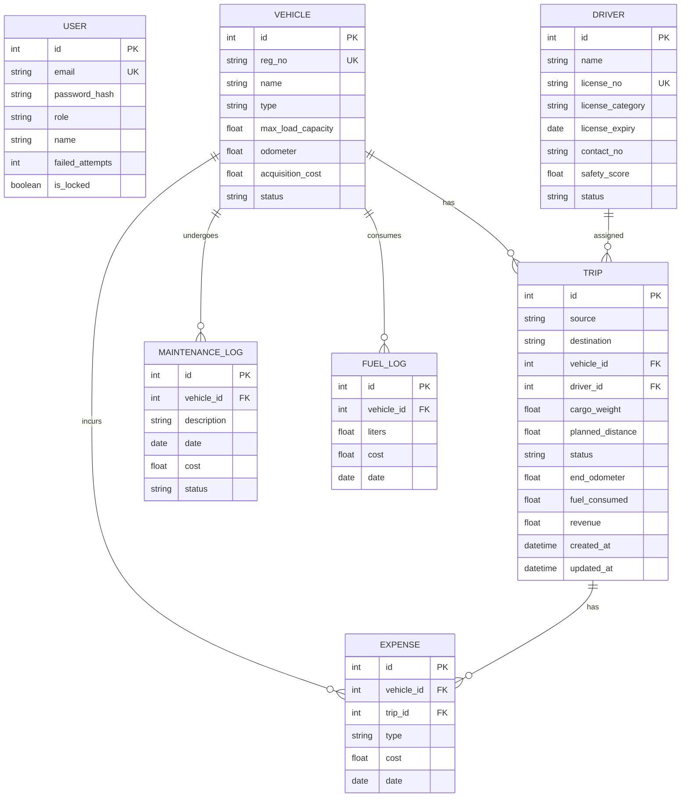

# TransitOps - Smart Transport Operations Platform
*Winning Prototype for Odoo Hackathon 2026*

TransitOps is a centralized, end-to-end transport operations ERP designed to digitize vehicles, drivers, dispatches, maintenance workshop scheduling, and trip expense ledgers. Built with Odoo's modular design philosophy, it features role-based access control (RBAC), robust business validations, and live operational analytics.

---

## Tech Stack & Architecture

- **Frontend:** React 18, Vite, Tailwind CSS v4, Zustand, Lucide Icons
- **Backend:** FastAPI (Python 3.12), SQLAlchemy 2.0 (ORM), PyJWT, Uvicorn
- **Database:** SQLite (default local development), PostgreSQL (production-ready)
- **Local Dev Server:** Concurrently managed hot-reloads via bash traps

---

## Database Schema



---

## Getting Started

### Prerequisites
- Python 3.12+ installed
- Node.js 18+ installed

### 1. Setup Backend
Activate the virtual environment, install requirements, and initialize/seed the local database:
```bash
cd backend
python3 -m venv venv
source venv/bin/activate
pip install -r requirements.txt
python app/seed/seed_data.py
```

### 2. Setup Frontend
Install client dependencies:
```bash
cd frontend
npm install
```

### 3. Launch Platform
Use the root launcher to start both services concurrently:
```bash
# From workspace root
chmod +x ./start.sh
./start.sh
```
- **Frontend Dashboard:** http://localhost:5173
- **FastAPI API Documentation:** http://localhost:8000/docs

---

## Role-Based Access Control (RBAC)

Use these **Quick Sandbox Logins** on the login screen to test scoped access rights:
- **Fleet Manager:** `manager@transitops.in` (Scopes: Fleet Registry & Maintenance Logs)
- **Dispatcher:** `dispatcher@transitops.in` (Scopes: Trip Dispatcher & Live Board)
- **Safety Officer:** `safety@transitops.in` (Scopes: Driver Registry & Safety Compliance)
- **Financial Analyst:** `analyst@transitops.in` (Scopes: Fuel Ledger & Reports/ROI)

*Default Sandbox password: `password123`*

---

## Mandatory Business Rules Implemented

1. **Unique Registration IDs:** Rejects duplicate vehicle registration entries at both frontend form and database unique constraints.
2. **Cargo Capacity Guard:** Trips block dispatch submissions dynamically if `Cargo Weight > Vehicle Max Load Capacity`.
3. **Availability State Lock:** Vehicles or drivers marked `On Trip` are locked from active dispatch lists to prevent scheduling conflicts.
4. **Maintenance Lockout:** Active workshop repair records set vehicles to `In Shop` status, immediately hiding them from dispatch dropdowns.
5. **License Validity Locks:** Suspended driver profiles or drivers with expired licenses are blocked from trip assignments.
6. **Account Brute-Force Rule:** Password authentication records failed login counts. Accounts lock automatically on the 5th consecutive failure.
